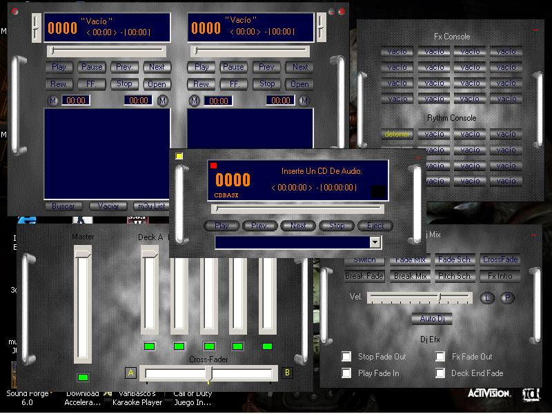



## Dj Box 4

### Description

This is a proyect i been working on so many months. As you can see in the picture it's a complete DJ software to mix your mp3 in party's. Well what can i say, it has lots of modules i've recopilated from this page. Incorporates m3u and pls lists, id3 tags, fx and rythm mix, predifined mixes, skins, also cd control module, cutting for intros, fade out, and an experimental lights module for use with printer port.
 
### More Info
 

             |
---                |---
**Submitted On**   |2004-03-24 15:48:06
**By**             |[Julio C\. Gotuzzo](https://github.com/Planet-Source-Code/PSCIndex/blob/master/ByAuthor/julio-c-gotuzzo.md)
**Level**          |Advanced
**User Rating**    |5.0 (25 globes from 5 users)
**Compatibility**  |VB 6\.0
**Category**       |[Complete Applications](https://github.com/Planet-Source-Code/PSCIndex/blob/master/ByCategory/complete-applications__1-27.md)
**World**          |[Visual Basic](https://github.com/Planet-Source-Code/PSCIndex/blob/master/ByWorld/visual-basic.md)
**Archive File**   |[Dj\_Box\_41733494142004\.zip](https://github.com/Planet-Source-Code/julio-c-gotuzzo-dj-box-4__1-53161/archive/master.zip)

